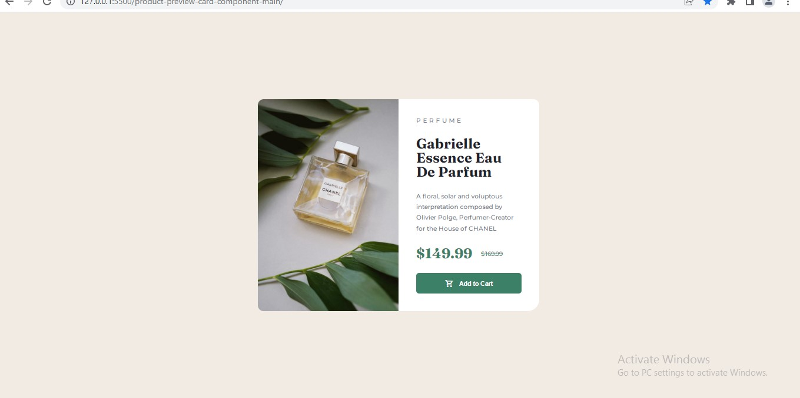
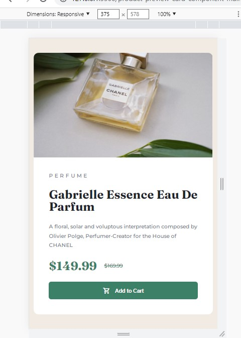

# Frontend Mentor - Product preview card component solution

This is a solution to the [Product preview card component challenge on Frontend Mentor](https://www.frontendmentor.io/challenges/product-preview-card-component-GO7UmttRfa). Frontend Mentor challenges help you improve your coding skills by building realistic projects.

## Table of contents

- [Overview](#overview)
  - [The challenge](#the-challenge)
  - [Screenshot](#screenshot)
  - [Links](#links)
- [My process](#my-process)
  - [Built with](#built-with)
  - [What I learned](#what-i-learned)
  - [Continued development](#continued-development)
  - [Useful resources](#useful-resources)
- [Author](#author)
- [Acknowledgments](#acknowledgments)

**Note: Delete this note and update the table of contents based on what sections you keep.**

## Overview

### The challenge

Users should be able to:

- View the optimal layout depending on their device's screen size
- See hover and focus states for interactive elements

### Screenshot




### Links

- Solution URL: [Add solution URL here](https://github.com/superuser2345/product-preview-card)
- Live Site URL: [Add live site URL here](https://superuser2345.github.io/product-preview-card/)

## My process

### Built with

- Semantic HTML5 markup
- CSS custom properties
- Flexbox

### What I learned

In this challenge I have tried to use Flexbox and felt great that I have done it using flexbox. I am happy to learn this.

Major things I learn like:

1.  Aligning Flexbox

```css
body {
  background-color: hsl(30, 38%, 92%);

  text-align: center;
  font-family: "Montserrat", sans-serif;
  font-size: 1rem;
  margin-left: auto;
  margin-right: auto;
}

section {
  width: 35%;
  height: 100vh;
  overflow: auto;
  margin: 0 auto;
  display: flex;
  align-items: center;
  justify-content: center;
}
```

2.  I learn how to use image as background instead of inserting into HTML for responsiveness.

```html
<div class="container">
  <div class="product-image"></div>
</div>
```

```css
.product-image {
  width: 100%;
  border-radius: 10px 0 0 10px;
  background-image: url(/product-preview-card-component-main/images/image-product-desktop.jpg);
  background-repeat: no-repeat;
  background-size: 100% 100%;
}
```

3.  I learn how to use :first-child. It helps me to make my mobile preview 

```css
.container:first-child {
  display: flex;
  flex-direction: column;
  height: 40%;
  flex: 1 auto;
}
.container:last-child {
  display: flex;
  flex-direction: column;
  height: 60%;
  flex: 1 auto;
}
```

### Continued development

I really loved Flexbox and onward will only be using flex-box. And It was just basics that what I have used. I will be more focusing on Using Long Codes and Nth Childs techniqes.

### Useful resources


-[Example Resource 1](https://developer.mozilla.org/en-US/docs/Learn/CSS/CSS_layout/Flexbox) - This is where I have started and learn Flexbox concept. Most Important.
-[Example Resource 2](https://stackoverflow.com/questions/12172177/set-div-height-equal-to-screen-size) - This helped me setting my section height to the screen height. 
-[Example Resource 3](https://www.tutorialrepublic.com/faq/how-to-change-the-cursor-into-a-hand-pointer-on-hover-using-css.php) - This helped me converting my cursor to pointer (hand)
-[Example Resource 4](https://www.w3schools.com/css/css_rwd_mediaqueries.asp) - This helped me writing media queries.
-[Example Resource 5](https://www.folkstalk.com/2022/09/how-to-fit-background-image-to-div-size-with-code-examples.html) - This helped me for setting my image background within a div. Which ultimately helped me to get rid of my  and used css instead.

## Author

- Website - [Sunil Dutt](https://www.digiruth.com)
- Frontend Mentor - [@superuser2345](https://www.frontendmentor.io/profile/superuser2345)
- Twitter - [@swayamdutt](https://www.twitter.com/swayamdutt)


## Acknowledgments

I want to give a hat to myself (though not being arrogant). Yes, I have done it alone, though taken help from the resources mentioned above, but still I came back after 4 days and sat around 4 hours to complete this challenge. I am really happy and proud about it.
